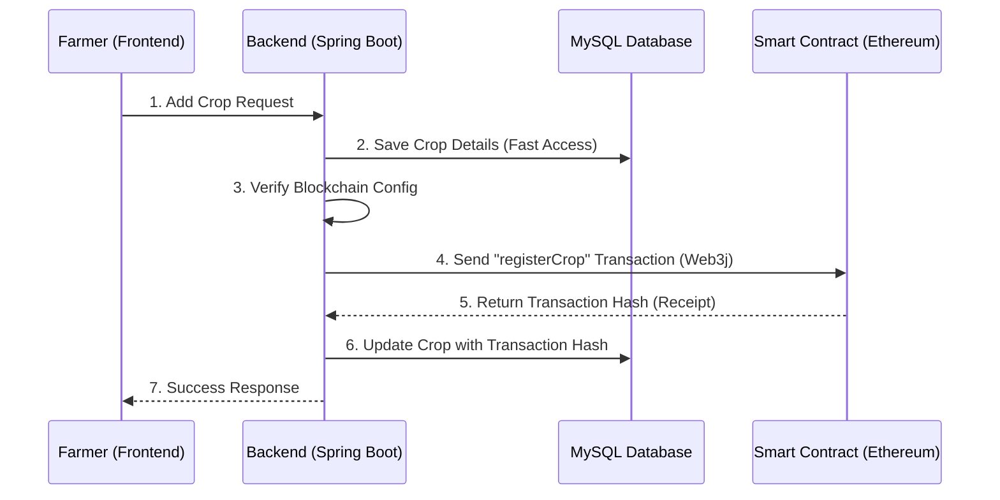

# FarmXChain Blockchain Documentation

This document provides a comprehensive overview of how Blockchain is implemented in FarmXChain, why it is used, and how the underlying technology works.

## 1. Why Use Blockchain in FarmXChain?

In a traditional supply chain (Farm-to-Table), reliance on a central database creates issues like:
*   **Tampering**: A central admin can maliciously change data (e.g., change "Non-Organic" to "Organic").
*   **Lack of Trust**: Consumers cannot verify if the data they see is the original data entered by the farmer.
*   **Single Point of Failure**: If the database is hacked, the history is lost.

**Blockchain solves this by providing:**
*   **Immutability**: Once a crop record is added to the blockchain, it **cannot be changed or deleted**.
*   **Traceability**: Every crop has a unique "Transaction Hash" that acts like a digital fingerprint, pointing to its permanent record.
*   **Transparency**: The data is stored on a public/decentralized ledger (Ethereum) that anyone can verify, independent of the FarmXChain app.

---

## 2. Architecture: How It Works

The system follows a **Hybrid Architecture**, using a traditional database for speed and Blockchain for trust.



### Key Components

1.  **Frontend (React)**:
    *   Initiates the request. Displays the "Blockchain Hash" to the user as proof of registration.

2.  **Backend (Spring Boot)**:
    *   **Libraries**: Uses **Web3j**, a Java library for interacting with Ethereum nodes.
    *   **Service**: `BlockchainService.java` manages the connection, credential management (Wallet), and transaction signing.

3.  **Smart Contract (Solidity)**:
    *   **File**: `CropRegistry.sol`
    *   **Role**: Acts as the "Digital Notary". It receives crop data and permanently stores it in the blockchain state.

---

## 3. Implementation Details

### The Smart Contract (`CropRegistry.sol`)
We use a custom Solidity contract deployed on the Ethereum network.

*   **Structure**: It defines a `Crop` struct to hold data: `id`, `name`, `quantity`, `location`, `timestamp`.
*   **Functions**:
    *   `registerCrop(...)`: Writes new data to the block. Emits an event for tracking.
    *   `verifyCrop(...)`: Allows external parties to validation the data integrity.

### The Java Integration (`BlockchainService.java`)
This service acts as the bridge between Java and Ethereum.

1.  **Initialization**:
    *   Connects to the node URL defined in `application.properties` (e.g., `http://localhost:7545`).
    *   Loads the **Private Key** to sign transactions (Acting as the Admin Wallet).

2.  **Transaction Execution**:
    ```java
    // 1. Create Function Object
    Function function = new Function("registerCrop", ...args...);
    
    // 2. Encode to Hex
    String encodedFunction = FunctionEncoder.encode(function);
    
    // 3. Send Transaction
    txManager.sendTransaction(..., encodedFunction);
    ```

3.  **Fallback Mode**:
    *   If the blockchain is unreachable, the system gracefully falls back to a "Simulation Mode" to allow development to continue without errors.

---

## 4. Verification Workflow

1.  **Creation**: When a farmer adds a crop, they receive a **Transaction Hash** (e.g., `0xabc123...`).
2.  **Verification**: A consumer/buyer can copy this hash and put it into an Ethereum Block Explorer (like Etherscan, or locally in Ganache).
3.  **Confirmation**: The explorer will show the exact input data (Name, Quantity) that was signed by the contract, proving the item is authentic.
