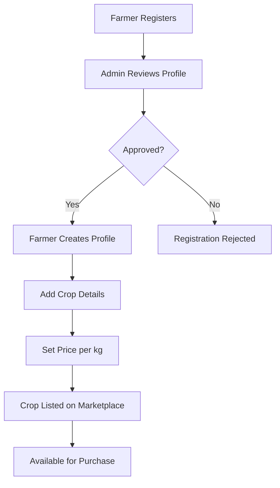
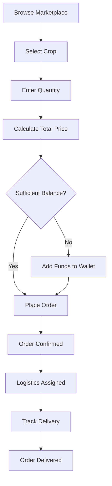
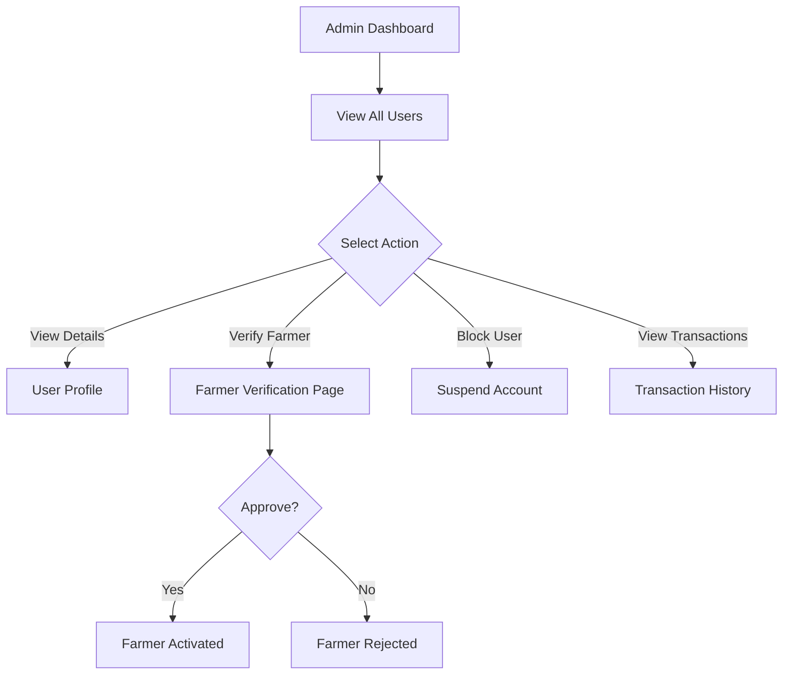

# FarmXChain - Complete Project Documentation

## 📋 Table of Contents
1. [Project Overview](#project-overview)
2. [System Architecture](#system-architecture)
3. [User Roles & Access](#user-roles--access)
4. [Complete Workflow Guide](#complete-workflow-guide)
5. [Page-by-Page Documentation](#page-by-page-documentation)
6. [Technical Stack](#technical-stack)

---

## 🌾 Project Overview

**FarmXChain** is a blockchain-powered agricultural supply chain management platform that connects farmers directly with distributors, retailers, and consumers. The platform provides transparency, traceability, and efficient transaction management across the entire agricultural supply chain.

### Key Features
- **Multi-Role System**: Supports Farmers, Distributors, Retailers, Consumers, and Admins
- **Blockchain Integration**: Ethereum-based smart contracts for crop registry
- **Real-time Tracking**: Order tracking and logistics management
- **Secure Transactions**: Wallet-based payment system
- **Admin Oversight**: Comprehensive admin panel for platform management

---

## 🏗️ System Architecture

### Technology Stack

#### Backend
- **Framework**: Spring Boot (Java)
- **Database**: MySQL
- **Blockchain**: Ethereum (Solidity Smart Contracts)
- **API**: RESTful services
- **Security**: JWT Authentication

#### Frontend
- **Framework**: React.js
- **Routing**: React Router
- **Styling**: Tailwind CSS
- **State Management**: React Hooks (useState, useEffect)

### Project Structure
```
FarmXChain/
├── backend/
│   ├── src/main/java/com/infosys/farmxchain/
│   │   ├── controller/     # REST API endpoints
│   │   ├── service/        # Business logic
│   │   ├── entity/         # Database models
│   │   └── repository/     # Data access layer
│   └── src/main/resources/
│       ├── contracts/      # Solidity smart contracts
│       └── database-setup.sql
└── frontend/
    └── src/
        ├── pages/          # React page components
        ├── services/       # API service layer
        └── utils/          # Helper utilities
```

---

## 👥 User Roles & Access

### 1. **FARMER** 🚜
**Purpose**: Producers who list and sell agricultural products

**Access Rights**:
- Create and manage farmer profile
- Add/edit/delete crop listings
- Set crop prices
- View and manage orders
- Track sales history
- Manage wallet balance

**Restricted From**:
- Admin functions
- Other farmers' data
- System-wide statistics

---

### 2. **DISTRIBUTOR** 🚚
**Purpose**: Bulk buyers who purchase from farmers and supply to retailers

**Access Rights**:
- Browse marketplace
- Purchase crops in bulk
- View farmer profiles and details
- Manage orders
- Track deliveries
- Manage wallet balance

**Restricted From**:
- Listing crops
- Admin functions
- Farmer verification

---

### 3. **RETAILER** 🏪
**Purpose**: Store owners who buy from distributors/farmers and sell to consumers

**Access Rights**:
- Browse marketplace
- Purchase crops
- View farmer details
- Manage orders
- Track deliveries
- Manage wallet balance

**Restricted From**:
- Listing crops
- Admin functions
- Bulk distributor features

---

### 4. **CONSUMER** 🛒
**Purpose**: End customers who purchase agricultural products

**Access Rights**:
- Browse marketplace
- Purchase crops for personal use
- View farmer profiles
- Track orders
- Manage wallet balance

**Restricted From**:
- Listing crops
- Admin functions
- Bulk purchasing features

---

### 5. **ADMIN** 👨‍💼
**Purpose**: Platform administrators who oversee and manage the entire system

**Access Rights**:
- **Full System Access**
- User management (all roles)
- Farmer verification/approval
- View all transactions
- Platform statistics
- User account control (block/unblock)
- System monitoring

**Responsibilities**:
- Verify farmer authenticity
- Monitor platform integrity
- Resolve disputes
- Manage user accounts
- Oversee transactions

---

## 🔄 Complete Workflow Guide

### Workflow 1: Farmer Onboarding & Crop Listing



**Step-by-Step**:
1. **Registration**: Farmer creates account with email/password
2. **Pending Status**: Account awaits admin verification
3. **Admin Verification**: Admin reviews farmer credentials
4. **Profile Creation**: Farmer fills in farm details, location, certifications
5. **Crop Management**: Farmer adds crops with:
   - Crop name
   - Quantity (kg)
   - Price per kg
   - Description
6. **Marketplace Listing**: Crops appear in marketplace for all buyers

---

### Workflow 2: Purchasing Flow (Buyer Perspective)



**Step-by-Step**:
1. **Browse**: User navigates to Marketplace
2. **Select Product**: Click on desired crop
3. **Specify Quantity**: Enter amount needed (in kg)
4. **Price Calculation**: System calculates: `Total = Quantity × Price per kg`
5. **Wallet Check**: System verifies sufficient balance
6. **Order Placement**: Buyer confirms purchase
7. **Payment Deduction**: Amount deducted from buyer's wallet
8. **Farmer Credit**: Amount added to farmer's wallet
9. **Logistics**: Order assigned tracking ID
10. **Delivery**: Buyer tracks order status

---

### Workflow 3: Admin User Management



**Step-by-Step**:
1. **Access Dashboard**: Admin logs in
2. **User Overview**: View total users by role
3. **User Management**: Click "Users" to see all accounts
4. **Filter by Role**: Use tabs (Farmers, Distributors, Retailers, Consumers)
5. **Verification Queue**: Check pending farmer verifications
6. **Review Credentials**: Examine farmer details
7. **Approve/Reject**: Make verification decision
8. **Account Control**: Block/unblock users if needed
9. **Transaction Monitoring**: View all platform transactions

---

## 📄 Page-by-Page Documentation

### 🔐 Authentication Pages

#### **Login Page** (`/login`)
**Purpose**: User authentication entry point

**Features**:
- Email/password login
- Role-based redirection
- "Remember me" option
- Link to registration

**Workflow**:
1. User enters credentials
2. System validates against database
3. JWT token generated
4. User redirected based on role:
   - Admin → `/admin-dashboard`
   - Farmer → `/dashboard`
   - Others → `/marketplace`

**Validation**:
- Email format check
- Password minimum length
- Account status verification (not blocked)

---

#### **Register Page** (`/register`)
**Purpose**: New user account creation

**Form Fields**:
- Name (required)
- Email (required, unique)
- Password (required, min 6 chars)
- Role selection (Farmer/Distributor/Retailer/Consumer)

**Workflow**:
1. User fills registration form
2. System validates input
3. Account created with status:
   - Farmer → `PENDING` (awaits verification)
   - Others → `ACTIVE`
4. Initial wallet balance: ₹0
5. Redirect to login

**Validation Rules**:
- Unique email
- Password strength
- All required fields filled

---

### 🌾 Farmer Pages

#### **Farmer Dashboard** (`/dashboard`)
**Purpose**: Farmer's main control panel

**Displayed Information**:
- Total crops listed
- Total sales/revenue
- Pending orders
- Recent activity

**Quick Actions**:
- Add new crop
- View orders
- Manage profile
- Check wallet balance

**Access**: Farmers only

---

#### **Farmer Profile** (`/farmer-profile`)
**Purpose**: Manage farmer business information

**Editable Fields**:
- Farm name
- Location/address
- Contact details
- Farm size
- Certifications
- Bio/description

**Features**:
- Profile photo upload
- Verification status display
- Public profile preview

**Workflow**:
1. Navigate to "My Profile"
2. Click "Edit Profile"
3. Update information
4. Save changes
5. Profile updated in database

---

#### **Crop Management** (`/crop-management`)
**Purpose**: Add, edit, and delete crop listings

**Crop Form Fields**:
- Crop name (required)
- Quantity in kg (required, number)
- Price per kg (required, number)
- Description (optional)
- Category (optional)

**Features**:
- **Add Crop**: Create new listing
- **Edit Crop**: Update existing crop details
- **Delete Crop**: Remove listing (if no active orders)
- **View All**: Table of all farmer's crops

**Table Columns**:
| Crop Name | Quantity (kg) | Price/kg | Total Value | Actions |
|-----------|---------------|----------|-------------|---------|
| Wheat     | 500          | ₹25      | ₹12,500     | Edit/Delete |

**Business Rules**:
- Cannot delete crop with pending orders
- Price must be positive
- Quantity must be positive

---

### 🛒 Marketplace & Shopping

#### **Marketplace** (`/marketplace`)
**Purpose**: Central hub for browsing and purchasing crops

**Available To**: All authenticated users

**Features**:
- **Search Bar**: Filter crops by name
- **Category Filter**: Filter by crop type
- **Farmer Filter**: View crops from specific farmer
- **Sort Options**: 
  - Price (low to high)
  - Price (high to low)
  - Quantity available

**Crop Card Display**:
```
┌─────────────────────────┐
│  Crop Image             │
│  Crop Name              │
│  Farmer: [Name]         │
│  Price: ₹XX/kg          │
│  Available: XXX kg      │
│  [Buy Now] [View Details]│
└─────────────────────────┘
```

**Purchase Flow**:
1. Click "Buy Now" on crop card
2. Modal opens with:
   - Crop details
   - Quantity input
   - Total price calculation
   - Wallet balance display
3. Enter desired quantity
4. System calculates: `Total = Quantity × Price/kg`
5. Click "Confirm Purchase"
6. Order created, payment processed
7. Success message displayed

**Validation**:
- Quantity ≤ Available stock
- Buyer balance ≥ Total price
- Quantity > 0

---

#### **Farmer List** (`/farmer-list`)
**Purpose**: Directory of all verified farmers

**Available To**: Distributors, Retailers, Consumers, Admin

**Display Format**:
- Grid/List view of farmer cards
- Each card shows:
  - Farmer name
  - Location
  - Number of crops
  - Rating (if implemented)
  - "View Profile" button

**Features**:
- Search farmers by name/location
- Filter by verification status
- Click to view detailed farmer profile

---

#### **Farmer Details** (`/farmers/:id`)
**Purpose**: Detailed view of individual farmer

**Sections**:
1. **Farmer Information**:
   - Name, location, contact
   - Farm details
   - Verification badge
   - Member since date

2. **Available Crops**:
   - List of all crops from this farmer
   - Direct purchase option
   - Stock availability

3. **Reviews** (if implemented):
   - Customer feedback
   - Rating statistics

---

### 📦 Order Management

#### **Orders Page** (`/orders`)
**Purpose**: View and manage all user orders

**Available To**: Farmers, Distributors, Retailers, Consumers

**Two Perspectives**:

**For Buyers** (Distributor/Retailer/Consumer):
- **My Purchases**: Orders placed by user
- Columns:
  - Order ID
  - Crop name
  - Farmer name
  - Quantity
  - Total price
  - Status
  - Track button

**For Farmers**:
- **Sales**: Orders received for farmer's crops
- Columns:
  - Order ID
  - Crop name
  - Buyer name
  - Quantity
  - Total price
  - Status
  - Actions

**Order Statuses**:
- `PENDING`: Order placed, awaiting processing
- `CONFIRMED`: Farmer confirmed order
- `SHIPPED`: In transit
- `DELIVERED`: Completed
- `CANCELLED`: Order cancelled

**Actions**:
- **Track Order**: View delivery status
- **View Details**: Full order information
- **Cancel** (if status = PENDING)

---

#### **Order Tracking** (`/tracking/:orderId`)
**Purpose**: Real-time order status tracking

**Display Elements**:
- Order ID and date
- Current status
- Estimated delivery
- Progress timeline:
  ```
  ✓ Order Placed
  ✓ Confirmed
  ⏳ In Transit
  ○ Delivered
  ```
- Logistics details (if available)
- Farmer/Buyer information

**Features**:
- Status updates
- Delivery location tracking (if GPS enabled)
- Contact farmer/support

---

### 👨‍💼 Admin Pages

#### **Admin Dashboard** (`/admin-dashboard`)
**Purpose**: Central admin control panel

**Key Metrics Displayed**:
- Total users (all roles)
- Total farmers
- Pending verifications
- Active users
- Recent transactions

**Quick Access Cards**:
1. **Transactions**: Link to all platform transactions
2. **User Management**: Access user database
3. **Verifications**: Pending farmer approvals

**Features**:
- System status indicator
- Refresh data button
- Navigation to all admin functions

---

#### **User Management** (`/user-management`)
**Purpose**: Comprehensive user database management

**Features**:
- **Tabbed Interface**:
  - All Users
  - Farmers
  - Distributors
  - Retailers
  - Consumers

**Each Tab Shows**:
- Count badge (e.g., "Farmers: 45")
- Percentage of total users

**User Table Columns**:
| Name | Email | Role | Status | Balance | Actions |
|------|-------|------|--------|---------|---------|
| John | john@email | FARMER | ACTIVE | ₹5,000 | Block/View |

**Actions Available**:
- **View Details**: Full user profile
- **Block User**: Suspend account access
- **Unblock User**: Restore account
- **Delete** (if no transactions)

**Search & Filter**:
- Search by name/email
- Filter by status (Active/Suspended)
- Sort by registration date

**Visual Indicators**:
- Blocked accounts: Dimmed/grayed out
- Status badges: Color-coded

---

#### **Farmer Verification** (`/farmer-verification`)
**Purpose**: Review and approve farmer registrations

**Pending Farmers List**:
- Shows all farmers with `PENDING` status
- Displays:
  - Farmer name
  - Email
  - Registration date
  - Farm details
  - Documents (if uploaded)

**Verification Process**:
1. Admin clicks "Review" on pending farmer
2. Modal/page shows:
   - Full farmer profile
   - Farm information
   - Contact details
   - Submitted documents
3. Admin reviews credentials
4. Decision:
   - **Approve**: Status → `ACTIVE`, farmer can list crops
   - **Reject**: Account remains `PENDING` or deleted

**Approval Criteria** (Admin Guidelines):
- Valid farm location
- Legitimate contact information
- Proper documentation
- No duplicate accounts

---

#### **Statistics Page** (`/statistics`)
**Purpose**: Platform analytics and insights

**Metrics Displayed**:
- Total users by role (pie chart)
- Total transactions
- Total revenue
- Crops listed
- Active orders
- Growth trends (if implemented)

**Charts & Graphs**:
- User distribution
- Sales over time
- Top-selling crops
- Top farmers by sales

**Export Options**:
- Download reports (CSV/PDF)
- Date range filters

---

#### **Admin Orders/Transactions** (`/admin/orders`)
**Purpose**: View all platform transactions

**Comprehensive Table**:
| Order ID | Date | Farmer | Buyer | Crop | Qty | Price | Status |
|----------|------|--------|-------|------|-----|-------|--------|
| #1234 | Jan 25 | John | Alice | Wheat | 50kg | ₹1,250 | Delivered |

**Features**:
- **Search**: By order ID, farmer, buyer, crop
- **Filter**: By status, date range, role
- **Sort**: By date, amount, status
- **Export**: Transaction reports

**Use Cases**:
- Monitor platform activity
- Resolve disputes
- Track revenue
- Audit transactions

---

### 👤 User Profile Pages

#### **User Profile** (`/profile`)
**Purpose**: Personal account management for non-farmers

**Available To**: Distributors, Retailers, Consumers

**Editable Information**:
- Name
- Email
- Phone number
- Delivery address
- Password change

**Displayed Information**:
- Account type (role)
- Member since
- Total orders
- Wallet balance

**Features**:
- Update profile
- Change password
- View order history
- Manage wallet

---

## 💰 Wallet System

### How It Works

**Initial Balance**: ₹0 for all new users

**Adding Funds** (Not fully implemented in current version):
- Users would add money via payment gateway
- Admin can manually adjust balances

**Deductions**:
- Automatic when placing orders
- Formula: `New Balance = Current Balance - Order Total`

**Credits**:
- Farmers receive payment when order is placed
- Formula: `New Balance = Current Balance + Order Total`

**Balance Display**:
- Shown in navbar for all users
- Format: ₹X,XXX
- Updates in real-time after transactions

**Insufficient Balance**:
- Order placement blocked
- Error message: "Insufficient wallet balance"
- Prompt to add funds

---

## 🔒 Security Features

### Authentication
- **JWT Tokens**: Secure session management
- **Password Hashing**: Encrypted storage
- **Role-Based Access**: Route protection

### Authorization
- **Route Guards**: `AuthGuard` component
- **API Validation**: Backend role checks
- **Token Expiry**: Automatic logout

### Data Protection
- **Input Validation**: Frontend and backend
- **SQL Injection Prevention**: Parameterized queries
- **XSS Protection**: React's built-in escaping

---

## 🔗 Blockchain Integration

### Smart Contracts

**CropRegistry.sol**:
- Stores crop information on blockchain
- Immutable crop records
- Ownership verification
- Transaction history

**Benefits**:
- Transparency
- Traceability
- Tamper-proof records
- Trust building

---

## 📱 Responsive Design

All pages are fully responsive:
- **Mobile**: Optimized for phones
- **Tablet**: Adapted layouts
- **Desktop**: Full-featured interface

**Breakpoints**:
- `sm`: 640px
- `md`: 768px
- `lg`: 1024px
- `xl`: 1280px

---

## 🚀 Getting Started Guide

### For Farmers
1. Register with role "Farmer"
2. Wait for admin approval
3. Create farmer profile
4. Add crops with prices
5. Manage orders as they come in

### For Buyers (Distributor/Retailer/Consumer)
1. Register with appropriate role
2. Account activated immediately
3. Browse marketplace
4. Add funds to wallet (if needed)
5. Purchase crops
6. Track orders

### For Admins
1. Login with admin credentials
2. Review pending farmer verifications
3. Monitor user activity
4. Manage user accounts
5. View transaction reports

---

## 📞 Support & Troubleshooting

### Common Issues

**"Insufficient Balance"**:
- Solution: Add funds to wallet

**"Order Failed"**:
- Check internet connection
- Verify crop availability
- Ensure sufficient balance

**"Access Denied"**:
- Verify correct role
- Check if account is blocked
- Re-login to refresh session

**Farmer "Pending Status"**:
- Wait for admin verification
- Contact admin if delayed

---

## 📊 Database Schema Overview

### Key Tables
- **users**: All user accounts
- **farmers**: Farmer-specific details
- **crops**: Crop listings
- **orders**: Transaction records
- **logistics**: Delivery tracking

### Relationships
- User → Farmer (1:1)
- Farmer → Crops (1:Many)
- User → Orders (1:Many)
- Order → Logistics (1:1)

---

## 🎯 Future Enhancements

Potential features for expansion:
- Payment gateway integration
- Real-time chat support
- Review/rating system
- Advanced analytics
- Mobile app
- GPS tracking
- Multi-language support
- Automated notifications

---

## 📝 Conclusion

FarmXChain provides a comprehensive platform for agricultural supply chain management, connecting all stakeholders in a transparent, efficient, and secure ecosystem. Each user role has specific capabilities designed to streamline their workflow while maintaining platform integrity through admin oversight.

---

**Document Version**: 1.0  
**Last Updated**: January 25, 2026  
**Platform**: FarmXChain  
**Contact**: Admin Dashboard for support
