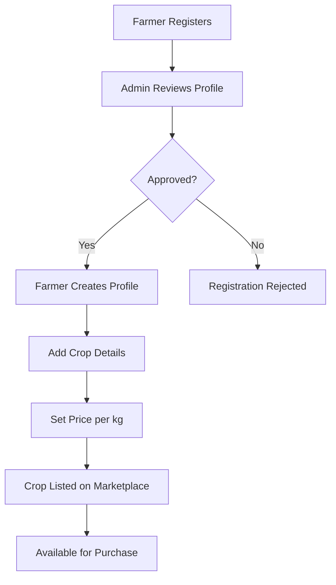
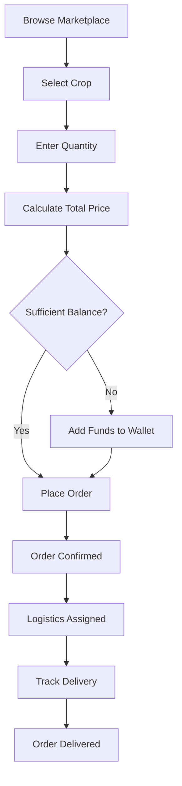
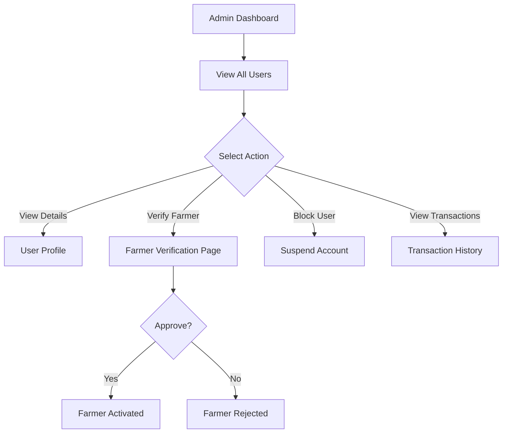
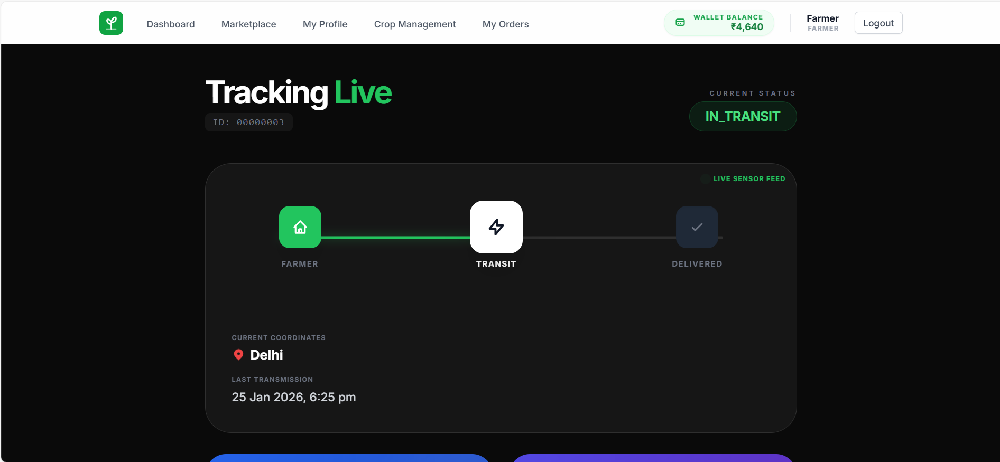

# FarmXChain 🌾⛓️

FarmXChain is a revolutionary, blockchain-powered agricultural supply chain platform designed to bring transparency and trust between farmers, retailers, and consumers. By leveraging Ethereum blockchain technology and a modern web stack, FarmXChain provides an immutable record of a crop's journey—from the initial soil registration to the final marketplace transaction.

## 📋 Table of Contents
1. [Vision](#-vision)
2. [System Workflows](#-system-workflows)
3. [Application Features](#-application-deep-dive)
4. [Technology Stack](#️-technology-stack)
5. [Getting Started](#-getting-started)
6. [Recognition](#-recognition)

---

## 🚀 Vision

The traditional agricultural supply chain suffers from a lack of transparency and high intermediary costs. **FarmXChain** solves this by:
1.  **Immutable Traceability**: Registering crop details on-chain.
2.  **Verified Sellers**: Ensuring only authenticated farmers can list produce.
3.  **Direct Market Access**: Connecting farmers directly with retailers.
4.  **Multi-Role Ecosystem**: Supporting Farmers, Distributors, Retailers, Consumers, and Admins.

---

## 🔄 System Workflows

### Workflow 1: Farmer Onboarding & Crop Listing



**Step-by-Step**:
1. **Registration**: Farmer creates account with email/password
2. **Pending Status**: Account awaits admin verification
3. **Admin Verification**: Admin reviews farmer credentials
4. **Profile Creation**: Farmer fills in farm details, location, certifications
5. **Crop Management**: Farmer adds crops with name, quantity, price, and description
6. **Marketplace Listing**: Crops appear in marketplace for all buyers

---

### Workflow 2: Purchasing Flow (Buyer Perspective)



**Step-by-Step**:
1. **Browse**: User navigates to Marketplace
2. **Select Product**: Click on desired crop
3. **Specify Quantity**: Enter amount needed (in kg)
4. **Price Calculation**: System calculates: `Total = Quantity × Price per kg`
5. **Wallet Check**: System verifies sufficient balance
6. **Order Placement**: Buyer confirms purchase
7. **Payment Processing**: Amount deducted from buyer's wallet and credited to farmer
8. **Logistics Assignment**: Order assigned tracking ID
9. **Delivery Tracking**: Buyer tracks order status until delivery

---

### Workflow 3: Admin User Management



**Step-by-Step**:
1. **Access Dashboard**: Admin logs in
2. **User Overview**: View total users by role
3. **User Management**: Navigate to user management page
4. **Filter by Role**: Use tabs (Farmers, Distributors, Retailers, Consumers)
5. **Verification Queue**: Check pending farmer verifications
6. **Review Credentials**: Examine farmer details and documents
7. **Approve/Reject**: Make verification decision
8. **Account Control**: Block/unblock users if needed
9. **Transaction Monitoring**: View all platform transactions

---

## 📸 Application Deep-Dive

### 🔐 Authentication & Onboarding
The platform features a secure, multi-role authentication system.

| Feature | Description | Screenshot |
| :--- | :--- | :--- |
| **User Registration** | New users can sign up as either a **Farmer**, **Distributor**, **Retailer**, or **Consumer**. Farmers are prompted to provide basic details and are informed that they must undergo a verification process by the admin before they can list crops. |  |
| **Secure Login** | A modern, streamlined login portal. The system uses JWT (JSON Web Tokens) to manage sessions securely, ensuring that users can only access features corresponding to their authorized role. |  |

---

### 👑 Administrator Control Panel
Administrators act as the curators of the ecosystem, ensuring platform health and user legitimacy.

#### 📊 Dashboard & Analytics
| Page | Detailed Walkthrough |
| :--- | :--- |
| **Admin Dashboard** | The central hub for administrators. It provides a real-time snapshot of the platform's scale, showing the total number of users, the count of registered farmers, and how many verification requests are currently pending. |
| **Dashboard Activity** |  |
| **System Statistics** | For data-driven management, the Stats page visualizes user growth and platform activity over time. This helps admins identify peak registration periods and manage resource allocation. |
| **Analytics View** |  |

#### 🛡️ Governance & User Management
| Page | Detailed Walkthrough |
| :--- | :--- |
| **User Management** | A comprehensive list of every user on the platform. Admins can view user roles, contact information, and account status, allowing for efficient community management and auditing. |
| **User List** |  |
| **Farmer Verification** | **The Trust Anchor.** All farmers must be verified here. Admins review identity and land ownership documents uploaded during registration. Once satisfied, the admin "Verifies" the farmer, granting them the ability to use the blockchain registry. |
| **Verification Portal** |  |

#### 📈 Transaction Monitoring (Milestone 3)
| Page | Detailed Walkthrough |
| :--- | :--- |
| **Transaction Overview** | Comprehensive view of all platform transactions, including order details, buyer-seller information, amounts, and statuses. This enables admins to monitor platform activity and resolve disputes. |
| **Transaction Dashboard** |  |

---

### 🚜 Farmer Workspace
A dedicated portal for farmers to manage their digital farm and interact with the blockchain.

#### 🌿 Crop Management
| Page | Detailed Walkthrough |
| :--- | :--- |
| **Farmer Dashboard** | A personalized view for farmers to see their active listings, total sales, and the status of their current crop batches. It provides quick access to add new produce to the marketplace. |
| **Farmer Home** |  |
| **Add Crop (Blockchain)**| This is where the magic happens. Farmers enter detailed crop data including name, quantity, category, and date of harvest. They also pin their farm location via **Google Maps** and upload images. Upon submission, a transaction is triggered to record this data on the **Ethereum Blockchain**. |
| **On-Chain Registry** |  |

#### 📁 Identity & Directory
| Page | Detailed Walkthrough |
| :--- | :--- |
| **Farmer Profile** | A professional profile page where farmers can manage their personal branding and credentials. This information is partially visible to retailers to build trust before a purchase. |
| **Profile Management** |  |
| **Farmer Directory** | A searchable index of all verified farmers on the platform. This internal directory allows for transparency and helps admins keep track of the growing farmer community. |
| **Directory View** |  |

---

### 🛒 Marketplace & Retailer Flow
Where the supply meets the demand with full traceability.

| Page | Detailed Walkthrough |
| :--- | :--- |
| **Public Marketplace**| A vibrant catalog of all verified crops available. Each listing displays the price, quantity, and a "Verification Badge." Users can click on a crop to see its full history, including its origin and the specific blockchain transaction hash. |
| **Marketplace View** |  |
| **Retailer Dashboard**| Retailers have a specialized view to manage their purchases and track the transit of crops they've acquired. It highlights the supply chain data for every item in their inventory. |
| **Retailer Home** |  |

---

### 📦 Order Management & Tracking (Milestone 3)

#### Sale Hubs & Distribution Centers
| Page | Detailed Walkthrough |
| :--- | :--- |
| **Distribution Network** | View of sale hubs and distribution centers across the network, enabling efficient logistics and delivery management. |
| **Sale Hubs** |  |

#### Real-Time Order Tracking
| Page | Detailed Walkthrough |
| :--- | :--- |
| **Order Tracking** | Real-time tracking of orders with status updates, delivery timeline, and logistics information. Buyers can monitor their purchases from confirmation to delivery. |
| **Tracking Dashboard** |  |

**Order Statuses**:
- `PENDING`: Order placed, awaiting processing
- `CONFIRMED`: Farmer confirmed order
- `SHIPPED`: In transit
- `DELIVERED`: Completed
- `CANCELLED`: Order cancelled

---

### 👤 Generalized User Profile
Standardized across all roles, the **User Profile** allows individuals to update their contact information, change passwords, and maintain their digital presence on the platform.


---

## 🛠️ Technology Stack

| Layer | Technology |
| :--- | :--- |
| **Frontend** | React.js, Tailwind CSS (Modern UI/UX) |
| **Backend** | Spring Boot (Java), Spring Security, JWT |
| **Database** | MySQL (Permanent Storage) |
| **Blockchain** | Solidity, Ethereum (Ganache/Remix), Web3.js |
| **Maps** | Google Maps API (Location Services) |

### System Architecture

```
FarmXChain/
├── backend/
│   ├── src/main/java/com/infosys/farmxchain/
│   │   ├── controller/     # REST API endpoints
│   │   ├── service/        # Business logic
│   │   ├── entity/         # Database models
│   │   └── repository/     # Data access layer
│   └── src/main/resources/
│       ├── contracts/      # Solidity smart contracts
│       └── database-setup.sql
└── frontend/
    └── src/
        ├── pages/          # React page components
        ├── services/       # API service layer
        └── utils/          # Helper utilities
```

---

## 🏁 Getting Started

### Prerequisites
- Node.js & npm (v16+)
- JDK 17 (Java)
- MySQL Server
- Ganache (Local Blockchain Ethereum instance)

### Installation & Setup
1.  **Clone the Repository**
    ```bash
    git clone https://github.com/its-vikash-Kushwaha/FarmXChain-finalProject.git
    cd FarmXChain
    ```
2.  **Backend Configuration**
    - Edit `FarmXChain/src/main/resources/application.properties` with your MySQL and Blockchain RPC details.
    - Run: `./mvnw spring-boot:run` (or `mvnw.cmd spring-boot:run` on Windows)
3.  **Frontend Initialization**
    ```bash
    cd frontend
    npm install
    npm start
    ```
4.  **Smart Contract Deployment**
    - Open Remix IDE.
    - Deploy `CropRegistry.sol` to your Local Ganache Provider.
    - Update the Contract Address in the backend configuration.

### Quick Start by Role

#### For Farmers
1. Register with role "Farmer"
2. Wait for admin approval
3. Create farmer profile with farm details
4. Add crops with prices
5. Manage orders as they come in

#### For Buyers (Distributor/Retailer/Consumer)
1. Register with appropriate role
2. Account activated immediately
3. Browse marketplace
4. Add funds to wallet (if needed)
5. Purchase crops
6. Track orders

#### For Admins
1. Login with admin credentials
2. Review pending farmer verifications
3. Monitor user activity
4. Manage user accounts
5. View transaction reports

---

## 🔗 Blockchain Integration

### Smart Contracts

**CropRegistry.sol**:
- Stores crop information on blockchain
- Immutable crop records
- Ownership verification
- Transaction history

**Benefits**:
- **Transparency**: All crop data is publicly verifiable
- **Traceability**: Complete history from farm to table
- **Tamper-proof**: Blockchain ensures data integrity
- **Trust Building**: Verified, immutable records

---

## 📄 Recognition

This project was developed as part of the **Infosys Springboard** internship program, aimed at solving real-world supply chain challenges through emerging technologies.

**Platform**: FarmXChain  
**Version**: 2.0 (Including Order Management & Tracking - Milestone 3)  
**Last Updated**: January 2026

---

**Made with 🌾 for a transparent agricultural future**
